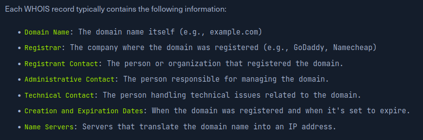
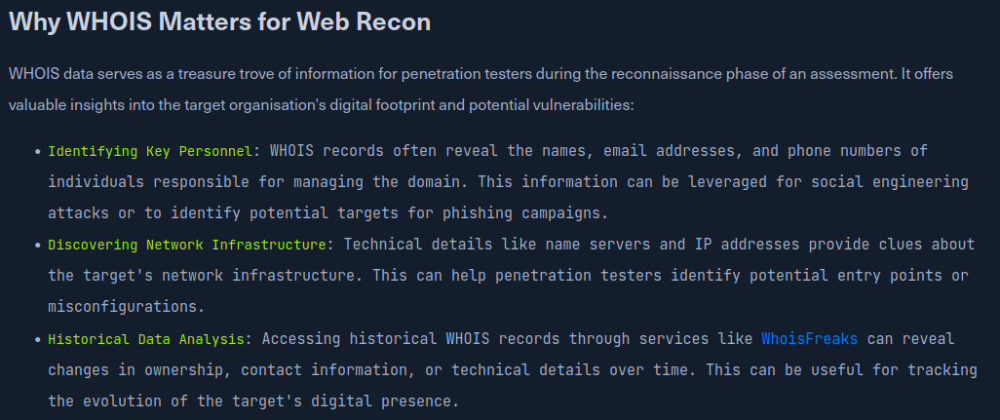
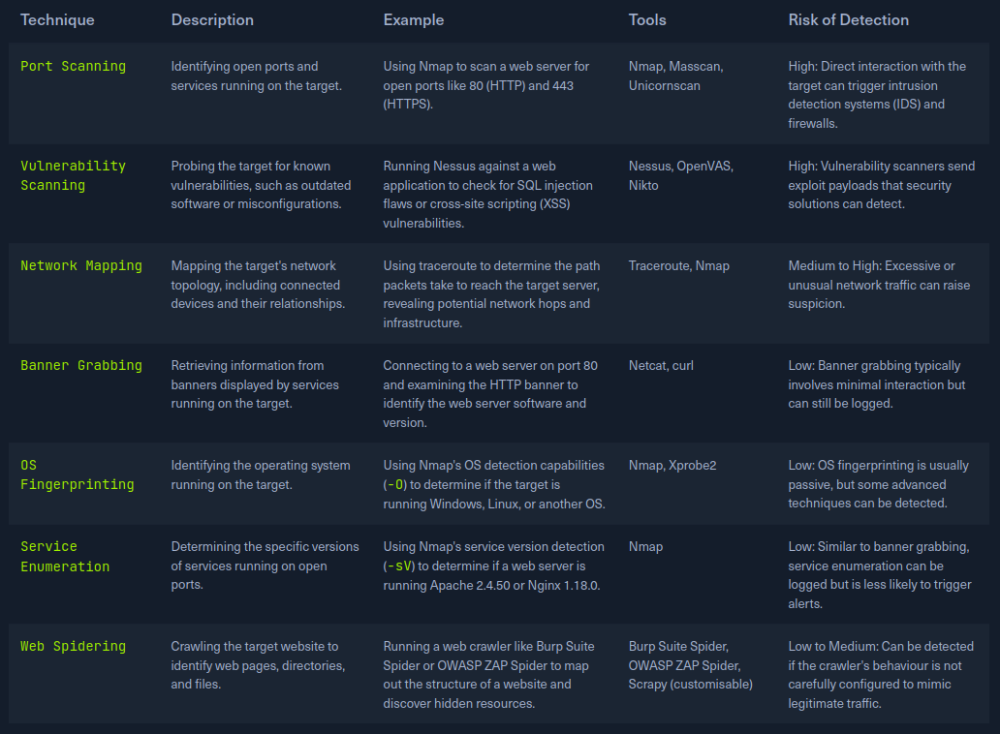
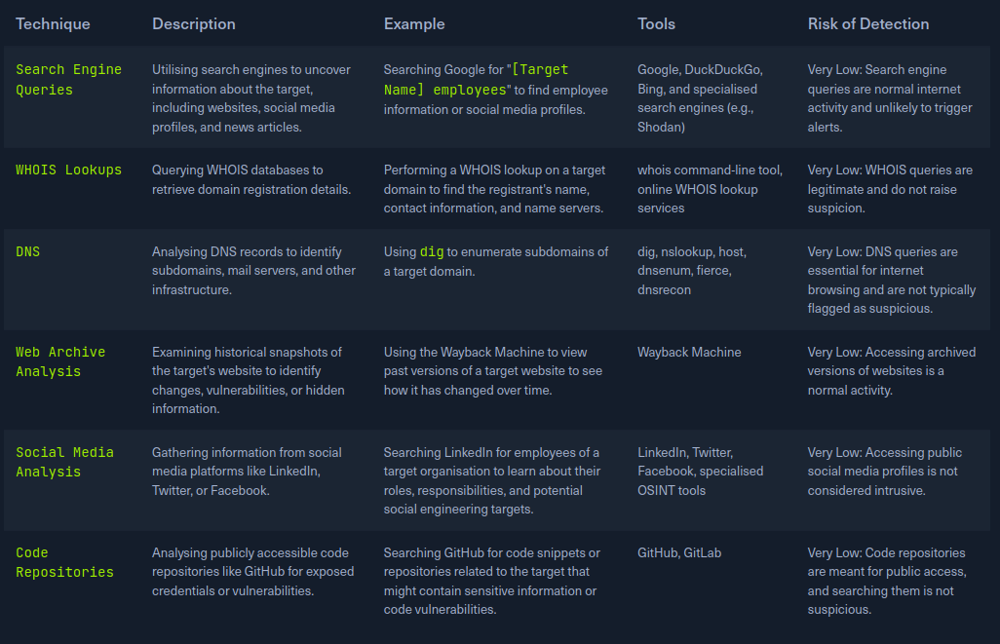

# Information Gathering - Web
*Step-by-Step Pentesting Reconnaissance Guide*

---

## **Overview**

This guide provides a systematic, step-by-step approach for gathering information about a target website during penetration testing. Follow these steps sequentially to build a comprehensive understanding of your target.


### **What You'll Achieve**
- **Identify all target assets** (domains, subdomains, IPs, services)
- **Discover hidden information** (backup files, admin panels, APIs)
- **Map the attack surface** (input points, technologies, vulnerabilities)
- **Gather intelligence** for targeted testing approaches

---

## **Table of Contents**

### **Getting Started**
- [Prerequisites](#prerequisites)
- [Quick Reference Commands](#quick-reference-commands)
- [Tool Installation](#tool-installation)

### **Step-by-Step Methodology**
- [Information Gathering - Web](#information-gathering---web)
  - [**Overview**](#overview)
    - [**What You'll Achieve**](#what-youll-achieve)
  - [**Table of Contents**](#table-of-contents)
    - [**Getting Started**](#getting-started)
    - [**Step-by-Step Methodology**](#step-by-step-methodology)
    - [**Additional Resources**](#additional-resources)
  - [**Prerequisites**](#prerequisites)
  - [**Step-by-Step Methodology**](#step-by-step-methodology-1)
  - [**STEP 1: PASSIVE INFORMATION GATHERING**](#step-1-passive-information-gathering)
    - [1.1 Domain Registration Intelligence](#11-domain-registration-intelligence)
    - [1.2 Search Engine Intelligence (Google Dorking)](#12-search-engine-intelligence-google-dorking)
  - [**STEP 2: DNS RECONNAISSANCE**](#step-2-dns-reconnaissance)
    - [2.1 Basic DNS Enumeration](#21-basic-dns-enumeration)
    - [2.2 Zone Transfer Testing](#22-zone-transfer-testing)
  - [**STEP 3: SUBDOMAIN DISCOVERY**](#step-3-subdomain-discovery)
    - [3.1 Automated Subdomain Enumeration](#31-automated-subdomain-enumeration)
    - [3.2 Virtual Host Discovery](#32-virtual-host-discovery)
    - [3.3 Certificate Transparency Logs](#33-certificate-transparency-logs)
  - [**STEP 4: ACTIVE RECONNAISSANCE**](#step-4-active-reconnaissance)
    - [4.1 Port Scanning](#41-port-scanning)
    - [4.2 HTTP/HTTPS Service Testing](#42-httphttps-service-testing)
  - [**STEP 5: WEB APPLICATION FINGERPRINTING**](#step-5-web-application-fingerprinting)
    - [5.1 Technology Stack Detection](#51-technology-stack-detection)
    - [5.2 Web Application Firewall Detection](#52-web-application-firewall-detection)
  - [**STEP 6: CONTENT DISCOVERY**](#step-6-content-discovery)
    - [6.1 Standard Files Check](#61-standard-files-check)
    - [6.2 Directory Enumeration](#62-directory-enumeration)
  - [**STEP 7: WEB CRAWLING \& ANALYSIS** 🕷](#step-7-web-crawling--analysis-)
    - [7.1 Automated Spidering](#71-automated-spidering)
    - [7.2 Manual Analysis](#72-manual-analysis)
  - [**STEP 8: VULNERABILITY SCANNING**](#step-8-vulnerability-scanning)
    - [8.1 Web Application Scanning](#81-web-application-scanning)
  - [**STEP 9: INFORMATION ANALYSIS**](#step-9-information-analysis)
    - [9.1 Create Target Profile](#91-create-target-profile)
    - [9.2 Prioritize Testing Targets](#92-prioritize-testing-targets)
  - [**STEP 10: DOCUMENTATION \& NEXT STEPS** 📝](#step-10-documentation--next-steps-)
    - [10.1 Evidence Organization](#101-evidence-organization)
    - [10.2 Plan Active Testing](#102-plan-active-testing)
  - [**Quick Reference Commands**](#quick-reference-commands)
    - [Essential Workflow](#essential-workflow)
    - [Tool Installation](#tool-installation)
  - [**Total Time Estimate: 3-4 Hours**](#total-time-estimate-3-4-hours)
  - [� **Important Reminders**](#-important-reminders)
    - [Legal \& Ethical](#legal--ethical)
    - [Operational Security](#operational-security)
    - [Passive vs Active](#passive-vs-active)
  - [**Additional Resources**](#additional-resources-1)

### **Additional Resources**
- [Quick Reference Commands](#quick-reference-commands)
- [Time Estimates](#total-time-estimate-3-4-hours)
- [Important Reminders](#important-reminders)
- [Additional Resources](#additional-resources)

---

## **Prerequisites**
- **Legal Authorization**: Ensure you have written permission to test the target
- **Target Scope**: Clearly defined IP ranges and domain boundaries  
- **Tools Installed**: Basic reconnaissance toolkit (see tool installation commands below)
- **Documentation Ready**: Prepare folders and note-taking system

---

## **Step-by-Step Methodology**

---

## **STEP 1: PASSIVE INFORMATION GATHERING**
*Collect intel without touching the target*

### 1.1 Domain Registration Intelligence

**Objective**: Gather ownership and infrastructure details from public records

```bash
# Basic WHOIS lookup
whois example.com
whois 192.168.1.1
```



**What to Document:**
- Registrar and registration dates
- Administrative/technical contacts  
- Name servers and DNS infrastructure
- Associated IP ranges

### 1.2 Search Engine Intelligence (Google Dorking)

**Objective**: Find exposed information through search engines

```bash
# Basic enumeration
site:example.com

# Find sensitive areas
site:example.com (inurl:admin OR inurl:login OR inurl:dashboard)
site:example.com (filetype:pdf OR filetype:doc OR filetype:xls)
site:example.com (inurl:config OR inurl:backup OR ext:conf)

# Look for errors and debug info  
site:example.com ("fatal error" OR "warning: mysql" OR "stack trace")
```

**Time Allocation**: 15-20 minutes

---

## **STEP 2: DNS RECONNAISSANCE**
*Map the domain's DNS infrastructure*

### 2.1 Basic DNS Enumeration

**Objective**: Understand DNS structure and find name servers

```bash
# Essential DNS queries
dig example.com ANY
dig example.com A
dig example.com MX  
dig example.com NS
dig example.com TXT
```



> **For detailed DIG commands and options, refer to**: [Dig.md](./Dig.md)

### 2.2 Zone Transfer Testing

**Objective**: Attempt to retrieve complete DNS zone data

```bash
# Test each discovered name server
dig @ns1.example.com example.com AXFR
dig @ns2.example.com example.com AXFR
```

**What Zone Transfers Reveal:**
- Complete subdomain list
- Internal IP addresses
- Network topology
- Hidden services

**Time Allocation**: 10-15 minutes

---

## **STEP 3: SUBDOMAIN DISCOVERY** 
*Find all subdomains and virtual hosts*

### 3.1 Automated Subdomain Enumeration

**Objective**: Discover all subdomains associated with the target

```bash
# Primary tool - dnsenum
dnsenum example.com

# Alternative methods
sublist3r -d example.com
amass enum -d example.com
gobuster dns -d example.com -w /usr/share/wordlists/subdomains.txt
```

> **For complete dnsenum usage and options, refer to**: [dnsenum.md](./dnsenum.md)

### 3.2 Virtual Host Discovery  

**Objective**: Find virtual hosts on discovered IP addresses

```bash
# Virtual host brute forcing
gobuster vhost -u http://example.com -w /usr/share/wordlists/subdomains.txt
```

### 3.3 Certificate Transparency Logs

**Objective**: Find subdomains through certificate databases

- Visit **crt.sh** and search for `%.example.com`
- Use **Censys** for certificate enumeration
- Check **Facebook CT API** for additional coverage

**Time Allocation**: 20-25 minutes

---

## **STEP 4: ACTIVE RECONNAISSANCE**  
*Direct interaction with target systems*



### 4.1 Port Scanning

**Objective**: Identify open services and ports

```bash
# Quick web service scan
nmap -sS -p 80,443,8080,8443,3000,5000,8000 example.com

# Comprehensive scan for discovered IPs
nmap -sS -p- --open target_ip

# Service version detection
nmap -sV -sC -p 80,443 example.com
```

### 4.2 HTTP/HTTPS Service Testing

**Objective**: Analyze web service configuration

```bash
# Basic connectivity and headers
curl -I http://example.com
curl -I https://example.com

# Security headers analysis
curl -I https://example.com | grep -E "(Strict-Transport|X-Frame|Content-Security)"
```

**Time Allocation**: 15-20 minutes

---

## **STEP 5: WEB APPLICATION FINGERPRINTING** 
*Identify technologies and security measures*

### 5.1 Technology Stack Detection

**Objective**: Determine web server, frameworks, and CMS

```bash
# Comprehensive fingerprinting
whatweb example.com
whatweb -a 3 -v example.com  # Aggressive mode

# Manual header analysis
curl -IL http://example.com
```

### 5.2 Web Application Firewall Detection

**Objective**: Identify security controls and filtering

```bash
# WAF detection
wafw00f http://example.com

# Manual testing with payloads
curl -H "User-Agent: <script>alert(1)</script>" http://example.com
```

**Time Allocation**: 10-15 minutes

---

## **STEP 6: CONTENT DISCOVERY** 
*Find hidden files, directories, and endpoints*

### 6.1 Standard Files Check

**Objective**: Check for common information disclosure files

```bash
# Essential file checks
curl http://example.com/robots.txt
curl http://example.com/sitemap.xml  
curl http://example.com/.well-known/security.txt
curl http://example.com/crossdomain.xml
```

### 6.2 Directory Enumeration

**Objective**: Discover hidden directories and files

```bash
# Directory brute forcing
gobuster dir -u http://example.com -w /usr/share/wordlists/dirb/common.txt

# File extension enumeration
gobuster dir -u http://example.com -w /usr/share/wordlists/dirb/common.txt -x php,asp,txt,html,js
```

**Time Allocation**: 25-30 minutes

---

## **STEP 7: WEB CRAWLING & ANALYSIS** 🕷
*Map application functionality and endpoints*

### 7.1 Automated Spidering

**Objective**: Discover all accessible content and functionality

**Using Burp Suite:**
1. Configure target scope
2. Start passive spider from proxy traffic
3. Enable active spider for comprehensive crawling
4. Analyze discovered sitemap

**Using OWASP ZAP:**
```bash
zap-cli quick-scan --self-contained http://example.com
```

### 7.2 Manual Analysis

**Objective**: Identify key application components

**Document:**
- Authentication mechanisms
- Input points (forms, parameters)
- API endpoints
- File upload functionality
- Administrative interfaces

**Time Allocation**: 20-25 minutes

---

## **STEP 8: VULNERABILITY SCANNING** 
*Identify potential security weaknesses*

### 8.1 Web Application Scanning

**Objective**: Find known vulnerabilities and misconfigurations

```bash
# Comprehensive web app scan
nikto -h http://example.com -o nikto_results.txt

# SSL/TLS security testing  
./testssl.sh example.com

# Certificate analysis
openssl s_client -connect example.com:443 -servername example.com
```

**Time Allocation**: 20-25 minutes

---

## **STEP 9: INFORMATION ANALYSIS** 
*Consolidate findings and prioritize targets*

### 9.1 Create Target Profile

**Objective**: Organize all discovered information

```
TARGET PROFILE: example.com
═══════════════════════════

📍 INFRASTRUCTURE:
├── Main: example.com (1.2.3.4)
├── Subdomains: admin.example.com, api.example.com
├── Services: HTTP/80, HTTPS/443
└── CDN: Cloudflare

 TECHNOLOGY:
├── Server: nginx/1.18.0
├── Backend: PHP 7.4
├── Framework: Laravel
└── CMS: Custom

ATTACK SURFACE:
├── Admin: /admin/, /wp-admin/
├── API: /api/v1/
├── Upload: /upload/
└── Auth: /login, /signin
```

### 9.2 Prioritize Testing Targets

**High Priority:**
- Administrative interfaces
- API endpoints  
- File upload functionality
- Development/staging environments

**Medium Priority:**
- User authentication
- Search functionality
- Contact forms

**Time Allocation**: 15-20 minutes

---

## **STEP 10: DOCUMENTATION & NEXT STEPS** 📝
*Prepare for active testing phase*

### 10.1 Evidence Organization

**Objective**: Create professional documentation for testing phase

```bash
# Create organized folder structure
mkdir -p recon_results/{dns,subdomains,ports,web,evidence}

# Save all command outputs with timestamps
script -a reconnaissance_$(date +%Y%m%d_%H%M).log
```

### 10.2 Plan Active Testing

**Objective**: Prepare testing strategy based on findings

**Next Phase Targets:**
1. **Authentication Testing** → Login mechanisms discovered
2. **Input Validation** → Forms and parameters identified  
3. **Authorization** → Admin panels and APIs found
4. **Business Logic** → Application workflows mapped

**Time Allocation**: 10-15 minutes

---

##  **Quick Reference Commands**

### Essential Workflow
```bash
# 1. Basic reconnaissance
whois example.com && dig example.com ANY

# 2. Subdomain discovery  
dnsenum example.com

# 3. Port scanning
nmap -sS -p 80,443,8080 example.com

# 4. Web fingerprinting
whatweb example.com && wafw00f http://example.com

# 5. Content discovery
curl http://example.com/robots.txt && gobuster dir -u http://example.com -w /usr/share/wordlists/dirb/common.txt

# 6. Vulnerability scanning
nikto -h http://example.com
```

### Tool Installation
```bash
# Install essential tools (Debian/Ubuntu)
sudo apt update && sudo apt install -y whois dnsutils nmap nikto gobuster dirb sublist3r dnsenum whatweb curl wget

# Additional tools
pip3 install wafw00f
```

---

## **Total Time Estimate: 3-4 Hours**

| Step | Phase                  | Time      |
| ---- | ---------------------- | --------- |
| 1    | Passive OSINT          | 15-20 min |
| 2    | DNS Reconnaissance     | 10-15 min |
| 3    | Subdomain Discovery    | 20-25 min |
| 4    | Active Reconnaissance  | 15-20 min |
| 5    | Web Fingerprinting     | 10-15 min |
| 6    | Content Discovery      | 25-30 min |
| 7    | Web Crawling           | 20-25 min |
| 8    | Vulnerability Scanning | 20-25 min |
| 9    | Information Analysis   | 15-20 min |
| 10   | Documentation          | 10-15 min |

---

## � **Important Reminders**

### Legal & Ethical
-  **Always ensure written authorization** before testing
-  **Stay within defined scope** boundaries
-  **Respect rate limits** to avoid system disruption
-  **Document everything** for professional reporting

### Operational Security  
-  Use **VPN/proxy** when appropriate
-  **Rotate user agents** to avoid detection patterns
-  **Space out requests** to prevent triggering security controls
-  **Monitor for defensive responses** during reconnaissance

### Passive vs Active


**Passive** = Undetectable, slower, public sources
**Active** = Detectable, faster, direct interaction

---

##  **Additional Resources**

- **Detailed DIG Usage**: [Dig.md](./Dig.md)
- **Complete DNSEnum Guide**: [dnsenum.md](./dnsenum.md)  
- **Wordlists**: `/usr/share/wordlists/` (SecLists package)
- **OWASP Testing Guide**: Web Application Security Testing methodology

---

*Last Updated: October 20, 2025*  
*Version: 2.1 - Step-by-Step Web Reconnaissance Methodology*